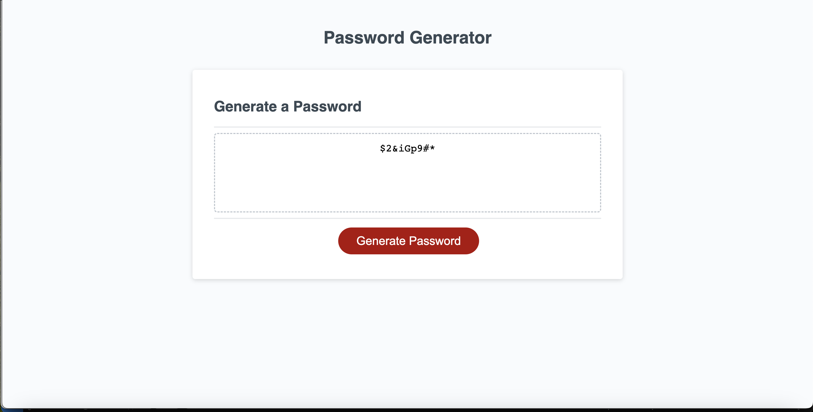

# Password Generator JS Project

## Mockup

## Description

This application demonstrates the developers proficiency in writing Javascript by generating a randomized password based on input provided to the application by the page visitor through a series of prompts/confirms.

## Link to live application
1. https://spritchard54.github.io/passWord_generator_SP/

## Basic Requirements
1. When the visitor clicks on the Generate Password button they are presented with a series of prompts
    - Prompt the user for the length (number of characters) of their password
    - Validate that the number of characters the visitor entered (>= 8 and <= 128)
    - Confirm upperCase characters are required
    - Confirm lowercase characters are required
    - Confirm special characters are required
    - User must select at least 1 character type

2. Randomly generate a password based on the visitor selections
    - After the visitor completes the final confirm a randomly generated password should appear in the card on the screen

## Languages Used
1. HTML
2. CSS
3. JavaScript